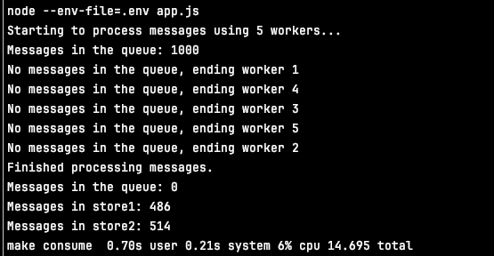
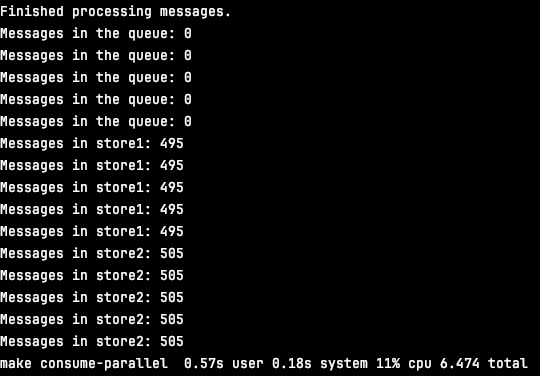

# Postgres as queue backend

## Goal

The goal of this project is to try to use postgres
as a queue backend. The idea is to use the `SKIP LOCKED` feature
of postgres to implement locking of messages and processing every message
exactly once.

The consumer script should process every message, remove it
from the queue, sort it by topic and store in table for the topic.

The final sum of items in topics tables should equal number of messages in queue.

## Result

Processing 1000 messages with 5 async workers:



Processing 1000 messages using 5 processes with 5 async workers each:



## Usage

1. Get a postgres database, e.g. using docker:

```bash
docker run --name postgres -e POSTGRES_PASSWORD=postgres -d postgres
```

Create a database in the container:

```bash
docker exec -it postgres psql -U postgres -c "CREATE DATABASE queue_db;"
```

2. Create a .env file containing database credentials

```bash
POSTGRES_HOST=localhost
POSTGRES_PORT=5432
POSTGRES_USER=postgres
POSTGRES_PASSWORD=postgres
POSTGRES_DB=postgres
```

3. Initialize the database

```commandline
make migrate
```

4. Start the generate script to put messages to queue

```commandline
make generate
```

To generate more messages in parallel, run
    
```commandline
make generate-parallel
```

5. Start the worker to consume messages from queue

```commandline
make consume
```
To consume more messages in parallel, run

```commandline
make consume-parallel
```

6. Clean the database for next run

```commandline
make clean
```
